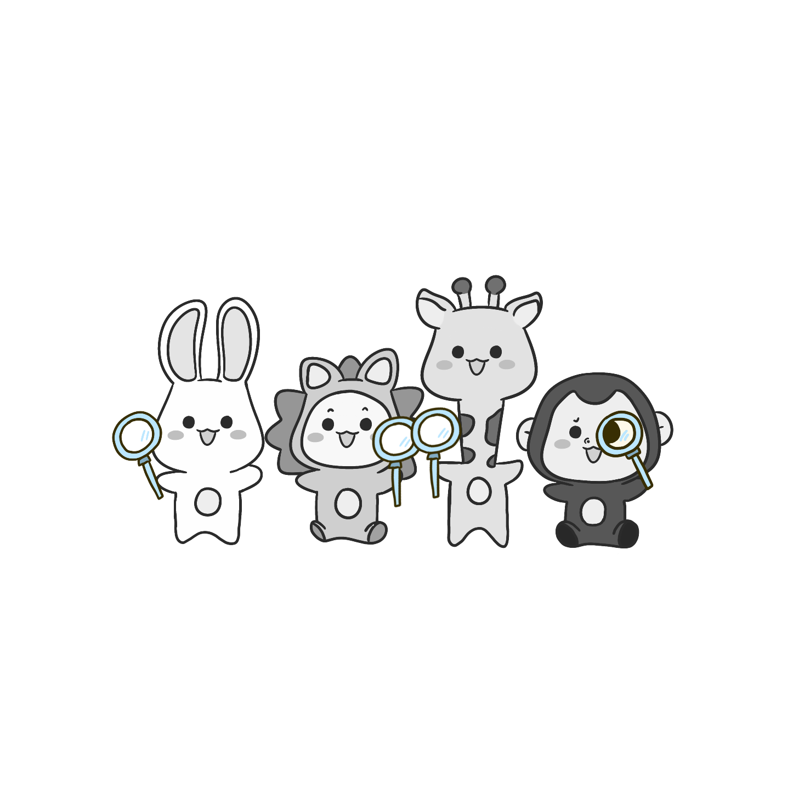
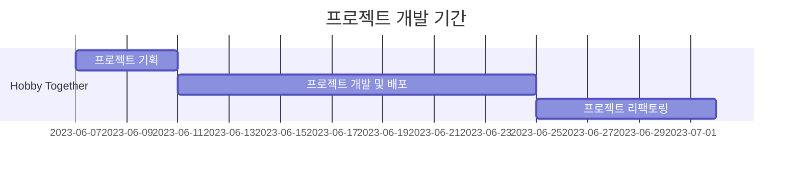

# <span id="top">Hobby Together</span>

## [🔗 Hobby Together 바로가기](https://fe5-team6-project.github.io/hobby_together/#/)

**[체험계정]**

-   ID : hobbytogether@gmail.com
-   PW : 123123a

<br/>
<br/>

## 1. HobbyTogether 서비스 소개


**Hobby Together**는 사람들이 함께 모여 취미 생활을 즐길 수 있는 플랫폼입니다. 이곳에서는 취미가 있는 사람과 취미를 즐기고 싶은 사람 모두 다양한 모임을 통하여 새로운 경험을 접할 수 있으며, 서로의 취미를 공유하고 소통할 수 있습니다.

<br/>

### 1. 취미를 공유하고 함께 즐기는 모임의 편리한 운영

-   한국현대인들은 바쁜 일상과 스트레스로 인해 취미 생활에 충분한 시간을 할애하기 어렵습니다. Hobby Together는 이러한 취미 생활 부족 문제를 해결하기 위해 만들어졌습니다. 우리는 사람들이 쉽고 편리하게 취미 생활을 찾고, 관심 있는 분야에서 다른 사람들과 함께 활동할 수 있는 기회를 제공합니다. Hobby Together를 통해 새로운 취미를 발견하고, 다양한 사람들과 함께 즐길 수 있는 기회를 만들어보세요.

### 2. 다양한 취미 분야의 교류와 지식 공유

-   모임의 특징을 알 수 있는 사진, 글, 참가 비용을 통해 모임을 생성하여 사람들과 모일 수 있습니다. 모임 후기와 자신의 일상을 공유할 수 있는 게시물을 업로드 하여 댓글과 좋아요를 통해 사람들과 원활한 소통을 하며 다양한 취미 분야의 교류가 가능합니다. 또한 사람들과 팔로우 하여 서로의 모임 글, 모임 후기 등을 볼 수 있습니다.

### 3. 매년 증가하고 우울증 예방과 건강한 취미 생활

-   코비드19로 인해 우리는 많은 제약과 어려움을 겪었습니다. 사회적 거리두기와 모임 제한 등으로 인해 혼자 있는 시간이 늘어났고, 함께 취미 생활을 즐기는 시간도 줄어들었습니다. 이러한 상황에서 Hobby Together는 사람들이 함께의 가치를 즐기며 다양한 취미 활동으로 심리적 안정과 행복감을 찾을 수 있도록 도와줍니다.

### 4. 사회적 연결과 친밀감 형성

-   취미 생활을 함께 하는 것은 여러 가지 이점을 가지고 있습니다. 우선, 취미를 공유하고 함께 활동하는 과정에서 새로운 인연을 만들 수 있습니다. 비슷한 취향을 가진 사람들과의 교류를 통해 친목을 도모하고 소통할 수 있습니다. 또한, 함께하는 취미 생활은 스트레스 해소와 행복감 증진에도 도움을 줍니다. 즐거운 경험을 체험해보세요!

<br/>
<br/>

## 2. 팀 소개

|                                  **권규리**                                  |                                  **김현태**                                  |                                  **오흥식**                                  |                                  **정혜민**                                  |
| :--------------------------------------------------------------------------: | :--------------------------------------------------------------------------: | :--------------------------------------------------------------------------: | :--------------------------------------------------------------------------: |
|                                     팀원                                     |                                     팀원                                     |                                   팀장 \*                                    |                                     팀원                                     |
|  |  |  |  |
|                    🔗[Gyuuul](https://github.com/Gyuuul)                     |                 🔗[hyuntae94](https://github.com/hyuntae94)                  |                  🔗[UngHeung](https://github.com/UngHeung)                   |                 🔗[haileyham](https://github.com/haileyham)                  |

<br/>
<br/>

## 3. 프로젝트 개발 기간



<br/>
<br/>

## 4. 프로젝트 목표

1. 리액트 실전 능력 향상

-   프로젝트를 통해 리액트를 실전에서 사용하고 익숙해지는 것을 목표
-   컴포넌트 기반 아키텍처와 상태 관리를 효과적으로 활용하여 복잡한 웹 어플리케이션을 개발하고, 실제 문제에 대한 해결 능력을 향상
-   학습한 React와 다양한 라이브러리를 활용하여 싱글 페이지 웹 어플리케이션을 개발

2. 협업과 코드 통합

-   GitHub Flow 방식을 채택하여 효과적인 코드 통합과 버전 관리를 수행
-   Pull Request 및 코드 리뷰를 통해 코드의 품질을 높이고, 충돌을 방지하며 안정적인 개발을 진행

3. 프로젝트 환경

-   프로젝트에서는 페어 프로그래밍과 같은 협업 도구를 사용하여 팀원들과의 협업 경험
-   팀원들과의 협업을 통해 안정적이고 효율적인 개발을 이끌어내는 것을 목표

<br/>
<br/>

## 5. 협업 방식

### 5-1. 브랜치 전략 : [GitHub-Flow](https://github.com/fe5-team6-project/withSix/issues/2)

-   단순하고 직관적인 워크플로우 : 팀원들간의 협업을 원활하게 진행할 수 있도록 쉽고 직관적인 GitHub-Flow 방식을 채택하였습니다. 잦은 충돌이 발생할 것을 방지하고자 작업을 작은 단위로 나누고 메인 브랜치에 지속적으로 머지하는 방식으로 진행하였습니다.
-   효과적인 협업과 코드 리뷰 : 팀원들 간의 효과적인 협업과 코드 리뷰를 장려하기 위해 사용하였습니다. 각 작업은 별도의 브랜치에서 수행되고, 다른 팀원들의 리뷰와 함께 승인을 받은 후에 메인 브랜치로 머지됩니다. 이를 통해 코드의 품질을 높이고 버그를 사전에 발견하여 소프트웨어의 안정성과 신뢰성을 향상시켰습니다.

    <br>

### 5-2. PR 팀원 컨펌

-   Pull Request(PR)는 코드 변경 사항을 리뷰 및 피드백을 받기 위해 메인 브랜치에 병합하기 전 제출하였습니다. PR은 최소 2명 이상의 팀원의 승인을 받고, 메인으로 병합하는 과정으로 진행하였습니다. 이를 통해 코드의 품질을 높이고 버그를 줄이며 충돌을 예방하였고, 팀원들 간의 효과적인 의사소통과 협업을 도모하였습니다.

    <br>

### 5-3. 프로젝트 진행 상황 관리 : [GitHub-Issues](https://github.com/fe5-team6-project/withSix/issues)

-   원활한 협업을 위하여 팀원들의 프로젝트 진행 상황을 모니터링하고, 의견을 공유하며 오류 발생 시 함께 문제를 해결하였습니다. 버그, 기능 요청, 작업 등과 같은 이슈를 추적하고 관리하였고, 이를 통해 팀원 간의 프로젝트의 진행 상황을 쉽게 파악할 수 있었습니다.

<br/>
<br/>

<p align="right"><a href="#top">TOP 🔼</a></p>

## 6. [컨벤션&프리티어](https://github.com/fe5-team6-project/withSix/issues/4)

프로젝트 진행 중 팀원 간의 원활한 소통과 협업을 위하여 커밋, 코드 컨벤션을 만들었습니다.

### 6-1. 커밋 컨벤션

6-1-1. 커밋 유형 지정

```
Feat: 새로운 기능 추가
Design : CSS, 사용자 UI 디자인 변경
Docs : 문서 수정
Style : 코드포맷, 세미콜론 누락, 개행, 코드 구조, 형태
Test : 테스트코드, 리팩토링 테스트 코드 추가
Refactor: 코드 리팩토링
Fix : 버그 및 오류 수정
Remove : 불필요한 파일 삭제
Chore : 빌드 업무, 패키지매니저, 폴더트리, 세팅 수정
rename: 파일명 혹은 폴더명 수정, 위치 옮기기
Comment : 필요한 주석 추가 및 변경
```

6-1-2. 커밋 메시지는 제목 & 본문 구성 & 이슈 번호

```
git commit -m "Feat : 팔로우 버튼 기능 구현 (#24)"
```

### 6-2. 코드 컨벤션

-   프리티어 설정

```
{
  "tabWidth": 4,
  "singleQuote": true,
  "semi": true,
  "printWidth": 80,
  "trailingComma": "es5"
}
```

-   css 컨벤션

```
position
display
width
height
margin
padding
border
background
font
기타
```

<br/>
<br/>

<p align="right"><a href="#top">TOP 🔼</a></p>

## 7. 개발 환경

### 7-1. 개발 환경

| 모듈명                | 용도                                                                                                                                                                                                                                                                                                                                                                                                                                                                                                                                                                                                                                                                                                                                                                                                                                                                                                                                                                                                                                                                                                                                                                                                                                                                                                                                                                                                                                                                          |
| --------------------- | ----------------------------------------------------------------------------------------------------------------------------------------------------------------------------------------------------------------------------------------------------------------------------------------------------------------------------------------------------------------------------------------------------------------------------------------------------------------------------------------------------------------------------------------------------------------------------------------------------------------------------------------------------------------------------------------------------------------------------------------------------------------------------------------------------------------------------------------------------------------------------------------------------------------------------------------------------------------------------------------------------------------------------------------------------------------------------------------------------------------------------------------------------------------------------------------------------------------------------------------------------------------------------------------------------------------------------------------------------------------------------------------------------------------------------------------------------------------------------- |
| 프론트엔드            |                                                                                                                                                                                                                                                                                                                                                                                                                                                                                                                                                                                                                                                                                                                                                                                                                                                                                                                                                                                                                         |
| 백엔드                | 멋쟁이사자처럼 프론트엔드 제공 API                                                                                                                                                                                                                                                                                                                                                                                                                                                                                                                                                                                                                                                                                                                                                                                                                                                                                                                                                                                                                                                                                                                                                                                                                                                                                                                                                                                                                                            |
| 도구 및 라이브러리    |       |
| 협업 및 프로젝트 관리 |                                                                                                                                                                                                                                                                                                                                                                                                                                                                                                                                                                                                                                                                                                                                                                                                                                                                   |
| 디자인                |                                                                                                                                                                                                                                                                                                                                                                                                                                                                                                                                                                                                                                                                                                                                                                                                                                                                                                                                                                                                                                                                                                                                                                               |

<br/>

### 7-2. [node modules](https://github.com/fe5-team6-project/withSix/issues/3)

| 모듈명                      | 용도                             |
| --------------------------- | -------------------------------- |
| react-router-dom            | 페이지 라우팅을 위해 사용        |
| axios                       | 서버와 통신을 위해 사용          |
| redux-tookit                | 전역 상태관리를 위해 사용        |
| styled-components           | 스타일 구현의 편의를 위해 사용   |
| react-slick                 | 이미지 슬라이드 구현을 위해 사용 |
| react-intersection-observer | 무한 스크롤 구현을 위해 사용     |

<p align="right"><a href="#top">TOP 🔼</a></p>
<br/>
<br/>

## 8. 폴더구조

```
│README.md
│package.json
│package-lock.json
│.prettierrc.js
│.gitignore
├─💼public
└─💼src
    ├─🗂️assets
    │  ├─📁icons
    │  ├─📁images
    │  │  └─🗂️common
    │  └─📁logo
    ├─🗂️components
    │  ├─📁common
    │  ├─📁date
    │  ├─📁follow
    │  ├─📁footer
    │  ├─📁header
    │  ├─📁likeButton
    │  ├─📁main
    │  ├─📁modal
    │  ├─📁postDetail
    │  │  ├─📁comments
    │  │  ├─📁postSideToggle
    │  │  └─🗂️utils
    │  ├─📁search
    │  ├─📁slick
    │  ├─📁together
    │  └─📁writebutton
    ├─🗂️lib
    │  ├─📁apis
    │  │  └─🗂️constant
    │  ├─📁utils / validation
    │  │  └─🗂️image
    ├─🗂️pages
    │   ├─📁chat
    │   ├─📁follow
    │   ├─📁home
    │   ├─📁login
    │   ├─📁main
    │   ├─📁post
    │   ├─📁profile
    │   ├─📁signup
    │   ├─📁together
    │   └─📁usersearch
    ├─🗂️route
    └─🗂️store
        └─📁slices
```

<p align="right"><a href="#top">TOP 🔼</a></p>
<br/>
<br/>

## 9. 역할 분담

<table>
  <thead>
    <tr>
      <th>이름</th>
      <th>역할</th>
      <th>기타</th>
    </tr>
  </thead>
  <tbody>
    <tr>
      <td rowspan="3"><strong>권규리</strong></td>
      <td><strong>게시물 페이지</strong></td>
      <td></td>
    </tr>
    <tr>
      <td>게시물 업로드 페이지</td>
      <td></td>
    </tr>
    <tr>
      <td>게시물 수정 페이지</td>
      <td></td>
    </tr>
    <tr>
      <td rowspan="6"><strong>김현태</strong></td>
      <td><strong>게시물 페이지</strong></td>
      <td></td>
    </tr>
    <tr>
      <td>게시물 상세 페이지</td>
      <td></td>
    </tr>
    <tr>
      <td><strong>유저 검색 페이지</strong></td>
      <td></td>
    </tr>
    <tr>
      <td><strong>기타</strong></td>
      <td></td>
    </tr>
    <tr>
      <td>무한 스크롤 구현</td>
      <td></td>
    </tr>
    <tr>
      <td>이미지 슬라이드</td>
      <td></td>
    </tr>
    <tr>
      <td rowspan="14"><strong>오흥식</strong></td>
      <td><strong>로그인 페이지</strong></td>
      <td><strong>[디자인]</strong></td>
    </tr>
    <tr>
      <td>로그인 메인 페이지</td>
      <td>피그마 UI 디자인</td>
    </tr>
    <tr>
      <td>이메일 로그인 페이지</td>
      <td>공통 레이아웃 컴포넌트 제작</td>
    </tr>
    <tr>
      <td>이메일 회원가입</td>
      <td>스타일 초기값 변수 설정</td>
    </tr>
    <tr>
      <td><strong>메인 피드 페이지</strong></td>
      <td></td>
    </tr>
    <tr>
      <td><strong>프로필 페이지</strong></td>
      <td></td>
    </tr>
    <tr>
      <td>사용자 프로필 페이지</td>
      <td></td>
    </tr>
    <tr>
      <td>사용자 프로필 수정 페이지</td>
      <td></td>
    </tr>
    <tr>
      <td>다른 사용자 프로필 페이지</td>
      <td></td>
    </tr>
    <tr>
      <td><strong>Splash 기능</strong></td>
      <td></td>
    </tr>
    <tr>
      <td><strong>모달 상태 관리 기능</strong></td>
      <td></td>
    </tr>
    <tr>
      <td><strong>유효성 검사</strong></td>
      <td></td>
    </tr>
    <tr>
      <td><strong>더보기 구현</strong></td>
      <td></td>
    </tr>
    <tr>
      <td><strong>채팅페이지 마크업</strong></td>
      <td></td>
    </tr>
    <tr>
      <td rowspan="9"><strong>정혜민</strong></td>
      <td><strong>모임 페이지</strong></td>
      <td>Splash 애니메이션</td>
    </tr>
    <tr>
      <td>모임 리스트 페이지</td>
      <td>404페이지 및 검색 배경 디자인</td>
    </tr>
    <tr>
      <td>모임 등록 페이지</td>
      <td><strong>[세팅]</strong></td>
    </tr>
    <tr>
      <td>모임 수정 페이지</td>
      <td>GitHub-Flow 협업 방식 공유</td>
    </tr>
    <tr>
      <td>모임 상세 페이지</td>
      <td>GitHub 컨벤션</td>
    </tr>
    <tr>
      <td><strong>팔로우</strong></td>
      <td>프로젝트 기초 셋팅</td>
    </tr>
    <tr>
      <td>팔로우 기능</td>
      <td>Readme</td>
    </tr>
    <tr>
      <td>팔로잉 목록 페이지</td>
      <td></td>
    </tr>
    <tr>
      <td>팔로워 목록 페이지</td>
      <td></td>
    </tr>
    <tr>
      <td><strong>공통</strong></td>
      <td>라우터 및 페이지 경로 관리</td>
      <td></td>
    </tr>
  </tbody>
</table>

<p align="right"><a href="#top">TOP 🔼</a></p>
<br/>
<br/>

## 10. 기능 시현

| Splash                                                                                                           | 회원가입1                                                                                                            | 회원가입2                                                                                                            |
| ---------------------------------------------------------------------------------------------------------------- | -------------------------------------------------------------------------------------------------------------------- | -------------------------------------------------------------------------------------------------------------------- |
|  |  |  |

| 로그인                                                                                                             | 로그아웃                                                                                                            | 홈피드                                                                                                         |
| ------------------------------------------------------------------------------------------------------------------ | ------------------------------------------------------------------------------------------------------------------- | -------------------------------------------------------------------------------------------------------------- |
|  |  |  |

| 내 프로필                                                                                                              | 상대 프로필                                                                                                               | 검색                                                                                                             |
| ---------------------------------------------------------------------------------------------------------------------- | ------------------------------------------------------------------------------------------------------------------------- | ---------------------------------------------------------------------------------------------------------------- |
|  |  |  |

| 카테고리                                                                                                          | 게시글 등록                                                                                                      | 게시글 상세                                                                                                           |
| ----------------------------------------------------------------------------------------------------------------- | ---------------------------------------------------------------------------------------------------------------- | --------------------------------------------------------------------------------------------------------------------- |
|  |  |  |

| 게시글수정                                                                                                           | 게시글 댓글                                                                                                       | 게시글,댓글 삭제                                                                                                 |
| -------------------------------------------------------------------------------------------------------------------- | ----------------------------------------------------------------------------------------------------------------- | ---------------------------------------------------------------------------------------------------------------- |
|  |  |  |

| 게시글신고                                                                                                       | 팔로잉                                                                                                           | 팔로잉 목록                                                                                                          |
| ---------------------------------------------------------------------------------------------------------------- | ---------------------------------------------------------------------------------------------------------------- | -------------------------------------------------------------------------------------------------------------------- |
|  |  |  |

| 모임 목록                                                                                                              | 모임 등록                                                                                                                | 모임 상세                                                                                                                |
| ---------------------------------------------------------------------------------------------------------------------- | ------------------------------------------------------------------------------------------------------------------------ | ------------------------------------------------------------------------------------------------------------------------ |
|  |  |  |

| 모임 수정                                                                                                              | 모임 삭제                                                                                                             | 포스트 없음                                                                                                         |
| ---------------------------------------------------------------------------------------------------------------------- | --------------------------------------------------------------------------------------------------------------------- | ------------------------------------------------------------------------------------------------------------------- |
|  |  |  |

| 무한 스크롤                                                                                                              | 채팅                                                                                                              | 로딩                                                                                                              |
| ------------------------------------------------------------------------------------------------------------------------ | ----------------------------------------------------------------------------------------------------------------- | ----------------------------------------------------------------------------------------------------------------- |
|  |  |  |

<p align="right"><a href="#top">TOP 🔼</a></p>
<br/>
<br/>

## 11. 트러블 슈팅

### 11-1. 전체 레이아웃과 모달, 상태관리(깃헙)

개발 초기에 공통 레이아웃을 설정하고 모달과 로그인 유저 정보 등과 같이 전역에서 사용할 정보들을 한 곳에서 관리할 수 있도록 하였습니다.
모달은 리덕스로 관리하였고, 필요한 페이지에서 정보를 업로드하여서 레이아웃에 있는 모달에 정보를 담아 보여지거나 감출 수 있도록 제작하였습니다.
또한 로그인, 회원가입 페이지를 제외한 모든 페이지가 하나의 레이아웃 컴포넌트를 사용하게 됨으로써 마크업, 스타일 코드량을 줄이고,
작업공간의 중복을 최소화하여서 상태관리 충돌을 최소화하였으며, 로그인, 회원가입을 제외한 페이지에 접근을 쉽게 막을 수 있도록 하였습니다.

### 11-2 이미지 미리 보기

기존에 이미지를 선택할때 이미지를 등록하고 그 주소를 받아와 미리보기를 표시하는 방식을 사용하였지만
파일을 바꿀 때마다 이미지를 서버에 올리지 않도록 하기위해 미리보기 주소를 반납해주는 URL.createObjectURL를 사용하여서
미리보기를 표시함으로써 최종 등록할 때만 사진을 업로드할 수 있도록 처리해주었습니다.

### 11-3 목록을 불러올 때

카테고리가 바뀌거나 더보기, 무한 스크롤 등으로 다음 목록을 불러올 때마다 목록을 모두 불러오지 않고
상태에 기존 목록을 저장하고 필요한 만큼의 목록만 요청해서 받아와 기존 목록에 추가하는 방식을 사용하였습니다.

### 11-4 프로필을 눌러 해당 유저의 프로필을 확인 시

목록을 받아올 때 프로필에 담긴 유저 정보를 해당 유저를 클릭할 때마다 리덕스 상태에 올려 재사용할 수 있도록 하였고, 그 데이터를 페이지로 이동시키는 방식을 사용하여서 불필요한 통신을 줄였습니다.

### 11-5 504 오류

하이퍼텍스트 전송 프로토콜 (HTTP) 504 Gateway Timeout 서버 에러 응답 코드는 서버가 게이트웨이 혹은 프록시의 역할을 하는 동안 시간 안에 업스트림 서버(upstream server)로부터 요청을 마치기 위해 필요한 응답를 받지 못했음을 나타냄. 등록 버튼 1번째 눌렀을 경우 : 504 오류, 등록 버튼 2번째 눌렀을 경우 : 정상으로 서버 응답 받음. 비동기 처리에 대한 이해도 부족으로 발생하였습니다. 504 오류를 해결하기 위해 API 호출을 2번 수행하는 방식으로 함수를 수정하였습니다. 이를 통해 네트워크 지연으로 인한 504 오류를 예방하고 데이터를 정상적으로 가져올 수 있게 되었습니다.

<br/>
<br/>

## 12. 예정 리팩토링 내용

| 리팩토링 예정 | 계획                                              |
| ------------- | ------------------------------------------------- |
| axios 이슈    | Interceptor를 활용 axios 요청 전후 특정 작업 수행 |
| 통신 이슈     | 통신할 때 추가 통신 방지                          |
| 이미지 최적화 | browser-image-compression 업로딩 이미지 압축      |
| 이미지 수정   | 리덕스 툴킷 남용 코드 수정                        |
| 시멘틱 마크업 | 시멘틱한 요소를 사용한 마크업으로 변경 예정       |
| 폴더정리      | 페이지 기능별 폴더 트리 정리                      |
| 스타일        | 전체적인 디자인 통일성 부여                       |

<p align="right"><a href="#top">TOP 🔼</a></p>
<br/>
<br/>
